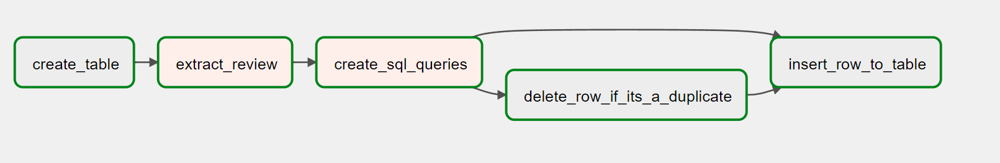

# An Airflow DAG to scrape review data from Steam and upload it to a Postgres database

## Project Overview
The goal was to create a simple ETL (Extract, Transform, Load) project implemented using Apache Airflow. The project aims to scrape Steam review data from a specific URL, parse the scraped data, and store it in a PostgreSQL database. The ETL process runs periodically every 30 minutes to fetch the latest review and update the database. The DAG will work for any game as long as the selected language of the webpage is english.

### Key components

1. URL Scraping: The project utilizes the **requests** library to retrieve the HTML content from the Steam review page specified by the URL.
2. Data Parsing: The scraped HTML content is parsed using the **BeautifulSoup** library. The relevant information, such as the reviewer's name, helpful votes count, hours played, review date, and review text, is extracted from the parsed HTML.
3. PostgreSQL Database Interaction: The project interacts with a PostgreSQL database to store the extracted Steam review data. The database is hosted at **localhost**.
4. DAG Structure: The ETL workflow is defined as an Airflow DAG (Directed Acyclic Graph). It consists of several tasks, including creating the review table (if it doesn't exist), scraping the Steam review data, generating SQL queries for insertion and deletion, and executing the SQL statements to update the database.
5. Task Dependencies: The tasks within the DAG are organized based on their dependencies. Each task is triggered upon the successful completion of its prerequisite task, ensuring the proper order of execution.
6. Error Handling and Retry: The project incorporates error handling by setting a number of retries and a retry interval for the tasks. If a task fails, it will be retried up to three times before raising an error.
7. Scheduling: The DAG is scheduled to run every 30 minutes using the Airflow scheduler. The **'start_date'** is set to May 11, 2023, and the '**catchup**' parameter is set to '**False**', ensuring that only future runs are processed.

It should be noted that this DAG will capture the latest review, so it is possible to miss on reviews that are posted between DAG runs.

## Airflow DAG

Overview of the DAG tasks:

1. The first task, **create_table**, creates the review table in the PostgreSQL database if it doesn't already exist. This ensures that the table is available for storing the scraped Steam review data.
2. The second task, **extract_review**, performs the scraping of the Steam review data. It fetches the HTML content of the Steam review page, parses it using BeautifulSoup, and extracts relevant information such as the review text, poster's name, helpful count, hours on record, and date.
3. The third task, **create_sql_queries**, generates SQL queries for insertion and deletion based on the scraped review data. It constructs the appropriate SQL statements, including the INSERT statement to add the review data to the table and the DELETE statement to remove duplicate entries.
4. The fourth task, **delete_row_if_its_a_duplicate**, deletes rows from the review table if there is already a row with the same poster and review text. This step ensures that only unique reviews are stored in the database.
5. The fifth task, **insert_row_to_table**, inserts the scraped review data into the PostgreSQL database. It executes the SQL INSERT statement to add the review details to the review table.

## Conclusion

In conclusion, the development of this project using Airflow was a great learning experience and an excellent first project to dive into the world of ETL workflows. The project successfully demonstrated the power and flexibility of Airflow in orchestrating complex data pipelines.

Overall, this project serves as a solid foundation for further exploration of Airflow and its capabilities in building robust and scalable data pipelines. It has provided valuable hands-on experience and set the stage for future data engineering endeavors.

